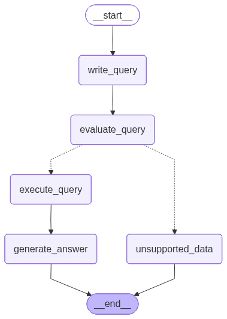
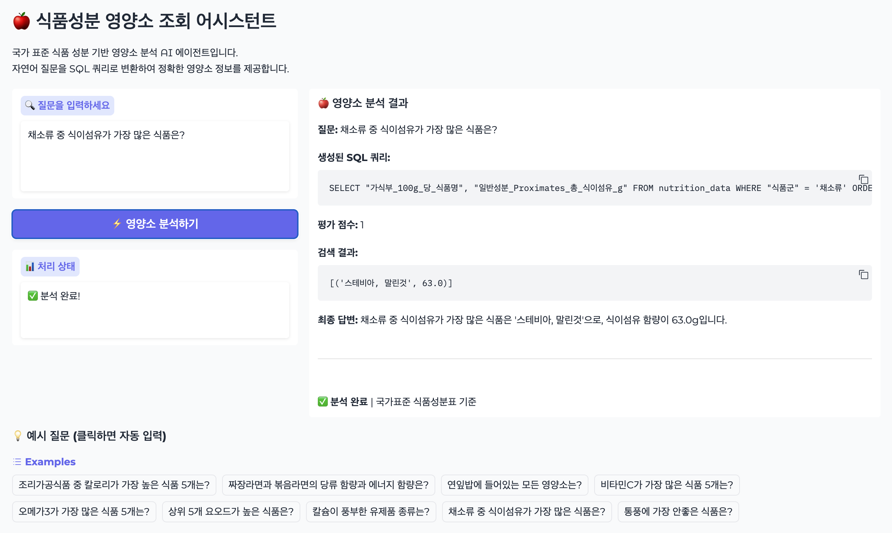
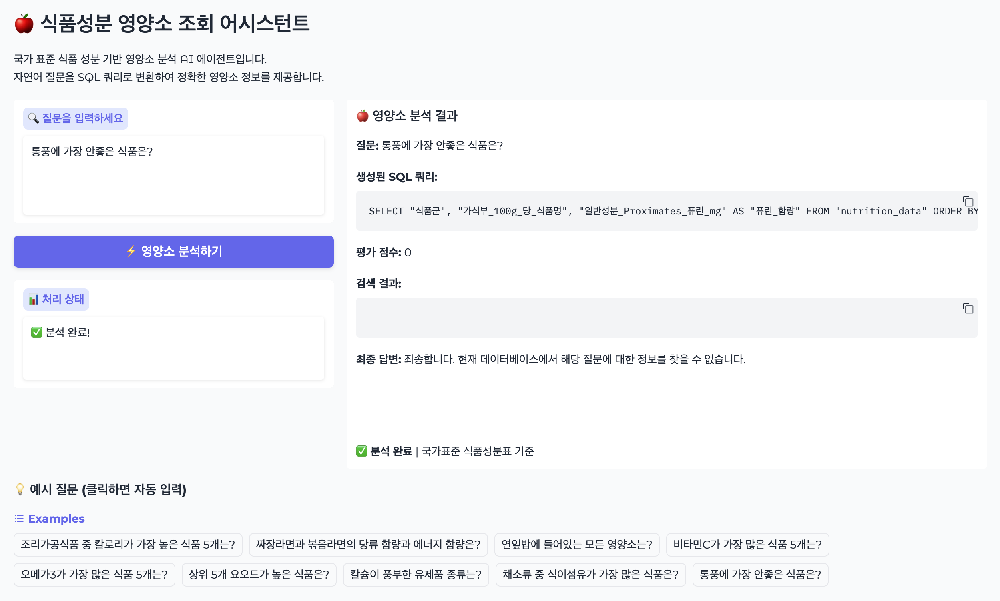

## LangChain / Gradio demo application

🍎 식품성분 영양소 조회 어시스턴트

국가 표준 식품 성분 기반 영양소 분석 AI 에이전트입니다.
자연어 질문을 SQL 쿼리로 변환하여 정확한 영양소 정보를 제공합니다.

Demo site: <https://huggingface.co/spaces/webispy/gradio-demo-test>


* 자료 출처: [식품성분표(10개정판).xlsx](https://www.data.go.kr/data/15123901/fileData.do) ("국가표준식품성분 Database 10.3" 시트)

### 동작 구조

#### 자료 전처리

* [국가표준식품성분 Database 10.3-표 1.csv](data/국가표준식품성분%20Database%2010.3-표%201.csv) 문서를 sqlite DB 형태로 변환
* [csv_converter.py](csv_converter.py) 스크립트 참조

#### LangChain

1. DB 스키마 정보를 이용해 사용자의 자연어 질의문을 sqlite query로 변환 (**write_query**)
1. 생성된 Query에서 실제 테이블에 없는 컬럼을 사용하는지 평가 (**evaluate_query**)
1. 평가 후 문제가 없으면 Query 실행 (**execute_query**)
1. **사용자 질의문**, **SQL 쿼리**, **SQL 쿼리 실행 결과**를 종합해서 답변 생성 (**generate_answer**)
1. 평가 단계에서 잘못된 컬럼을 사용하면 지원하지 않는 요청이라는 답변 생성 (**unsupported_data**)



#### Gradio

대화형 인터페이스 보다는 답변에 대한 처리 과정을 볼 수 있도록 Blocks 인터페이스 사용

##### 성공시 결과 화면



##### 지원하지 않는 요청 결과 화면



### 설치 준비

의존성 패키지 설치

```sh
uv sync
```

API 토큰 설정

```sh
echo "OPENAI_API_KEY=..." > .env
```

(Optional: 디버깅) LangSmith 토큰 설정: .env 파일에 아래 내용 추가

```
LANGSMITH_API_KEY=lsv2_pt_...
LANGSMITH_TRACING=true
LANGSMITH_PROJECT=...
```

### 실행

```sh
uv run gradio app.py
```

### 배포

Huggingface Space

```sh
uv run gradio deploy
```

Hugging Face 계정의 access token 입력

```sh
    _|    _|  _|    _|    _|_|_|    _|_|_|  _|_|_|  _|      _|    _|_|_|      _|_|_|_|    _|_|      _|_|_|  _|_|_|_|
    _|    _|  _|    _|  _|        _|          _|    _|_|    _|  _|            _|        _|    _|  _|        _|
    _|_|_|_|  _|    _|  _|  _|_|  _|  _|_|    _|    _|  _|  _|  _|  _|_|      _|_|_|    _|_|_|_|  _|        _|_|_|
    _|    _|  _|    _|  _|    _|  _|    _|    _|    _|    _|_|  _|    _|      _|        _|    _|  _|        _|
    _|    _|    _|_|      _|_|_|    _|_|_|  _|_|_|  _|      _|    _|_|_|      _|        _|    _|    _|_|_|  _|_|_|_|

Enter your token (input will not be visible):
Add token as git credential? (Y/n)
```

기본적인 정보 입력

```sh
Creating new Spaces Repo in '/Volumes/work/git/my/gradio_demo_nutrition'. Collecting metadata, press Enter to accept default value.
Enter Spaces app title [gradio_demo_nutrition]: gradio-demo-test
Enter Gradio app file [app.py]:
Enter Spaces hardware (cpu-basic, cpu-upgrade, cpu-xl, zero-a10g, t4-small, t4-medium, l4x1, l4x4, l40sx1, l40sx4, l40sx8, a10g-small, a10g-large, a10g-largex2, a10g-largex4, a100-large, h100, h100x8) [cpu-basic]:
```

OPENAI_API_KEY secret 추가

```sh
Any Spaces secrets (y/n) [n]: y
Enter secret name (leave blank to end): OPENAI_API_KEY
Enter secret value for OPENAI_API_KEY: sk-proj-....
Enter secret name (leave blank to end):
```

git push 여부 입력하고 기다림

```sh
Create Github Action to automatically update Space on 'git push'? [n]: y
Enter branch to track [main]:
Github Action created. Add your Hugging Face write token (from https://huggingface.co/settings/tokens) as an Actions Secret named 'hf_token' to your GitHub repository. This can be
set in your repository's settings page.
It seems you are trying to upload a large folder at once. This might take some time and then fail if the folder is too large. For such cases, it is recommended to upload in smaller batches or to use `HfApi().upload_large_folder(...)`/`hf upload-large-folder` instead. For more details, check out https://huggingface.co/docs/huggingface_hub/main/en/guides/upload#upload-a-large-folder.
Processing Files (1 / 1)                : 100%|██████████████████████████████████████████████████████████████████████████████████████████████████████████| 1.82MB / 1.82MB,  700kB/s
New Data Upload                         : 100%|██████████████████████████████████████████████████████████████████████████████████████████████████████████| 1.82MB / 1.82MB,  700kB/s
  ...mo_nutrition/data/nutrition_data.db: 100%|██████████████████████████████████████████████████████████████████████████████████████████████████████████| 1.82MB / 1.82MB
Space available at https://huggingface.co/spaces/webispy/gradio-demo-test
```

완료. 아래 URL을 통해 접속
<https://huggingface.co/spaces/webispy/gradio-demo-test>
