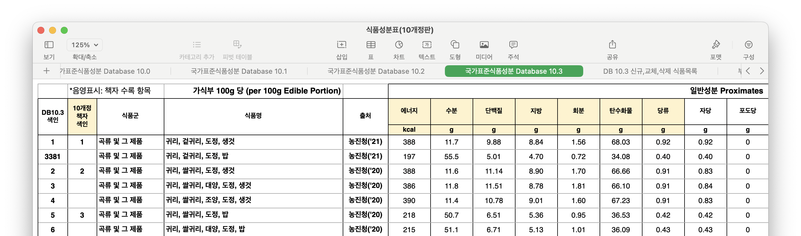
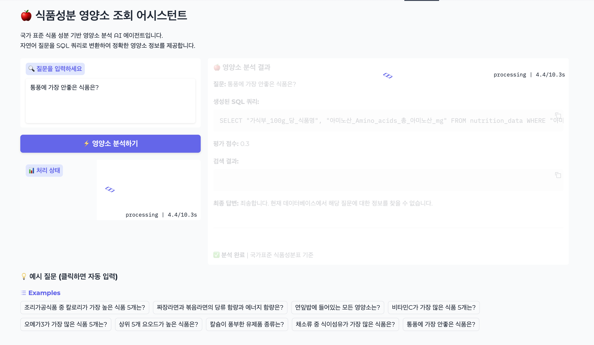
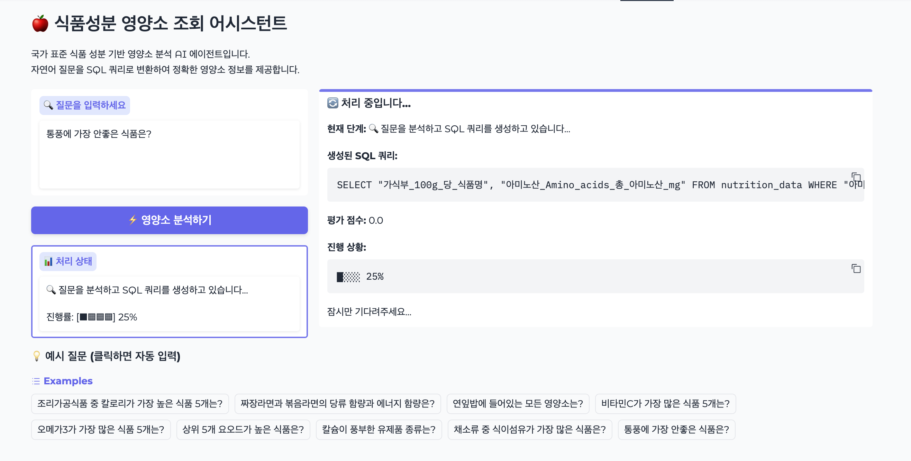

# 🍎 식품성분 영양소 조회 어시스턴트

> **국가 표준 식품 성분 기반 영양소 분석 AI 에이전트**
> 자연어 질문을 SQL 쿼리로 변환하여 정확한 영양소 정보를 제공합니다.

[](https://huggingface.co/spaces/webispy/gradio-demo-test)
[](https://gradio.app/)
[](https://langchain.com/)

**라이브 데모**: [https://huggingface.co/spaces/webispy/gradio-demo-test](https://huggingface.co/spaces/webispy/gradio-demo-test)

---

## 📋 프로젝트 개요

이 프로젝트는 한국 정부에서 제공하는 공식 식품 성분 데이터베이스를 활용하여, 사용자의 자연어 질문에 대해 정확한 영양소 정보를 제공하는 AI 어시스턴트입니다. LangChain과 LangGraph를 활용한 그래프 기반 워크플로우를 통해 복잡한 영양소 조회 과정을 자동화했습니다.

식품별 아래의 성분들에 대해 조회가 가능합니다.
- 일반성분 16개: 에너지, 수분, 단백질, 지방, 탄수화물 등
- 무기질 12개: 칼슘, 철, 마그네슘 등
- 비타민 33개: A, B, C 등
- 아미노산 21개: 총 아미노산, 필수 아미노산, 개별 아미노산 등
- 지방산 47개: 총 지방산, 포화/불포화/트랜스 지방산 및 개별 지방산 등


**데이터 출처**: [식품성분표(10개정판).xlsx](https://www.data.go.kr/data/15123901/fileData.do) - "국가표준식품성분 Database 10.3" 시트

---

## 🏗️ 시스템 아키텍처

### 데이터 전처리 단계

원본 Excel 파일을 효율적인 SQLite 데이터베이스로 변환하여 빠른 쿼리 처리를 가능하게 했습니다.

- **입력**: [국가표준식품성분 Database 10.3-표 1.csv](data/국가표준식품성분%20Database%2010.3-표%201.csv)
- **변환 도구**: [csv_converter.py](csv_converter.py)
- **출력**: SQLite 데이터베이스 파일



### LangGraph 기반 워크플로우


시스템은 5단계의 노드로 구성된 그래프 구조로 동작합니다:

1. **🔍 write_query**: 사용자의 자연어 질의를 SQLite 쿼리로 변환
2. **✅ evaluate_query**: 생성된 쿼리의 유효성 검증 (컬럼 존재 여부 확인)
3. **⚡ execute_query**: 검증된 쿼리 실행 및 결과 반환
4. **📝 generate_answer**: 질의문, 쿼리, 결과를 종합한 자연어 답변 생성
5. **❌ unsupported_data**: 지원하지 않는 요청에 대한 안내 메시지 생성

### Gradio 사용자 인터페이스

채팅 인터페이스 대신 **Blocks 구조**를 채택하여 각 처리 단계를 시각적으로 추적할 수 있도록 구현했습니다.

#### ✅ 성공적인 조회 결과


#### ⚠️ 지원하지 않는 요청 처리


#### ⏳ 처리중 상태




---

## 🔑 핵심 구현 포인트 및 성과

**LangChain 및 LangGraph 심화 경험**

LangChain에서 제공하는 기본 체인 구조와 LangGraph의 노드, 엣지, 조건부 엣지 연결을 직접 사용하여 복잡한 워크플로우 설계 역량을 향상시킬 수 있었습니다.

**실습 자료 활용의 중요성**

강의에서 제공된 실습 자료들이 프로젝트 구현 과정에서 핵심적인 참고 자료가 되었으며, 아이디어를 실체화 하는데 큰 도움이 되었습니다.

**예외처리 및 디테일의 중요성**

테스트를 하다 보니 LLM이 생성해주는 SQL Query에서 Hallucination을 발견할 수 있었습니다. 테이블에 없는 컬럼 이름이 들어간 Query문을 생성해 주었는데, Sqlite에서 에러가 발생하지 않아서 디버깅에 어려움이 있었습니다.

```sql
sqlite> SELECT "가식부_100g_당_식품명", "일반성분_Proximates_푸린_mg"
   ...> FROM nutrition_data
   ...> WHERE "일반성분_Proximates_푸린_mg" IS NOT NULL
   ...> ORDER BY "일반성분_Proximates_푸린_mg" DESC
   ...> LIMIT 10;
귀리, 겉귀리, 도정, 생것|일반성분_Proximates_푸린_mg
귀리, 겉귀리, 도정, 밥|일반성분_Proximates_푸린_mg
귀리, 쌀귀리, 도정, 생것|일반성분_Proximates_푸린_mg
```

생성된 Query 문장에서 컬럼 이름만 추출 후, 실제로 테이블에 존재하는지 유효성 검사 과정을 추가하여 해결할 수 있었습니다.

**사용자 경험 중심 설계**

전체적인 동작 흐름 파악을 위해 Gradio UI 구현 시 일반적인 채팅 인터페이스보다는 블록 구조가 더 적합하다고 판단했습니다. 각 상태 변화를 UI와 로그를 통해 실시간으로 확인할 수 있도록 구성하여 디버깅과 학습에 최적화했습니다.

---

## 🚧 개선 과제 및 향후 발전 방향

### 현재 한계점

**개발 일정의 제약**

하루라는 짧은 시간 내에 MVP 아이디어 도출부터 자료 수집, 데이터 전처리, LangChain 연동, Gradio UI 구성, Hugging Face Space 배포까지 모든 과정을 수행하다 보니 각 단계에서 충분한 검토와 최적화가 이루어지지 못한 아쉬움이 있습니다.

Github Actions을 이용해 Git repo에 커밋이 올라가면 자동으로 Hugging face Space에 배포하도록 하려고 하였으나 이슈(토큰 권한 등)가 있어 완성하지 못했습니다. (차후 진행 예정)

### 향후 확장 계획

**의료 정보 통합**

현재는 기본적인 영양소 정보만 제공하고 있으나, 질병과 관련된 영양소 및 성분 자료를 추가하여 개인의 건강 상태에 맞춤화된 영양 정보를 제공할 계획입니다.

현재는 Sqlite DB만을 사용하고 있는데, 질병 정보(논문 등)을 Vector store (Chroma DB 등)에 저장하여 같이 활용할 계획입니다.

---

## 🛠️ 설치 및 실행 가이드

### 필수 요구사항

- Python 3.8+
- uv (Python 패키지 매니저)
- OpenAI API 키

### 의존성 설치

```bash
uv sync
```

### 환경 변수 설정

```bash
echo "OPENAI_API_KEY=<your-api-key-here>" > .env
```

### (Optional) LangSmith 디버깅 설정

`.env` 파일에 다음 내용을 추가하여 LangSmith를 통한 상세 로깅을 활성화할 수 있습니다:

```bash
LANGSMITH_API_KEY=<your-langsmith-key>
LANGSMITH_TRACING=true
LANGSMITH_PROJECT=<your-project-name>
```

### 로컬 실행

```bash
uv run gradio app.py
```

---

## 🚀 배포 가이드

### Hugging Face Spaces 배포

```bash
uv run gradio deploy
```

배포 과정에서 다음 정보를 입력해야 합니다:

1. **Hugging Face Access Token**: 계정 설정에서 생성한 토큰
2. **앱 기본 정보**: 제목, 파일명, 하드웨어 스펙 선택
3. **API 키 등록**: OPENAI_API_KEY를 Spaces secrets에 안전하게 저장
4. **GitHub Actions 설정**: 자동 배포를 위한 워크플로우 구성 (선택사항)

배포 완료 후 제공되는 URL을 통해 즉시 접속할 수 있습니다.


Hugging Face 계정의 access token 입력

```sh
    _|    _|  _|    _|    _|_|_|    _|_|_|  _|_|_|  _|      _|    _|_|_|      _|_|_|_|    _|_|      _|_|_|  _|_|_|_|
    _|    _|  _|    _|  _|        _|          _|    _|_|    _|  _|            _|        _|    _|  _|        _|
    _|_|_|_|  _|    _|  _|  _|_|  _|  _|_|    _|    _|  _|  _|  _|  _|_|      _|_|_|    _|_|_|_|  _|        _|_|_|
    _|    _|  _|    _|  _|    _|  _|    _|    _|    _|    _|_|  _|    _|      _|        _|    _|  _|        _|
    _|    _|    _|_|      _|_|_|    _|_|_|  _|_|_|  _|      _|    _|_|_|      _|        _|    _|    _|_|_|  _|_|_|_|

Enter your token (input will not be visible):
Add token as git credential? (Y/n)
```

기본적인 정보 입력

```sh
Creating new Spaces Repo in '/Volumes/work/git/my/gradio_demo_nutrition'. Collecting metadata, press Enter to accept default value.
Enter Spaces app title [gradio_demo_nutrition]: gradio-demo-test
Enter Gradio app file [app.py]:
Enter Spaces hardware (cpu-basic, cpu-upgrade, cpu-xl, zero-a10g, t4-small, t4-medium, l4x1, l4x4, l40sx1, l40sx4, l40sx8, a10g-small, a10g-large, a10g-largex2, a10g-largex4, a100-large, h100, h100x8) [cpu-basic]:
```

OPENAI_API_KEY secret 추가

```sh
Any Spaces secrets (y/n) [n]: y
Enter secret name (leave blank to end): OPENAI_API_KEY
Enter secret value for OPENAI_API_KEY: sk-proj-....
Enter secret name (leave blank to end):
```

git push 여부 입력하고 기다림

```sh
Create Github Action to automatically update Space on 'git push'? [n]: y
Enter branch to track [main]:
Github Action created. Add your Hugging Face write token (from https://huggingface.co/settings/tokens) as an Actions Secret named 'hf_token' to your GitHub repository. This can be
set in your repository's settings page.
It seems you are trying to upload a large folder at once. This might take some time and then fail if the folder is too large. For such cases, it is recommended to upload in smaller batches or to use `HfApi().upload_large_folder(...)`/`hf upload-large-folder` instead. For more details, check out https://huggingface.co/docs/huggingface_hub/main/en/guides/upload#upload-a-large-folder.
Processing Files (1 / 1)                : 100%|██████████████████████████████████████████████████████████████████████████████████████████████████████████| 1.82MB / 1.82MB,  700kB/s
New Data Upload                         : 100%|██████████████████████████████████████████████████████████████████████████████████████████████████████████| 1.82MB / 1.82MB,  700kB/s
  ...mo_nutrition/data/nutrition_data.db: 100%|██████████████████████████████████████████████████████████████████████████████████████████████████████████| 1.82MB / 1.82MB
Space available at https://huggingface.co/spaces/webispy/gradio-demo-test
```

---

## 🔗 관련 링크

- **라이브 데모**: [https://huggingface.co/spaces/webispy/gradio-demo-test](https://huggingface.co/spaces/webispy/gradio-demo-test)
- **데이터 출처**: [공공데이터포털 - 식품성분표](https://www.data.go.kr/data/15123901/fileData.do)

---

## 📝 라이선스

이 프로젝트는 공공 데이터를 기반으로 하며, 교육 및 연구 목적으로 자유롭게 사용할 수 있습니다.